# Development process

How every change to Simple Manage Pro goes from idea to merged PR. It runs as
Claude Code skills (slash commands) and is built around two loops:

- the **outer loop** decides _what_ to build, once per epic;
- the **inner loop** builds one ticket and _proves it works_, once per ticket. Independent
  tickets run at the same time, each in its own Claude Code cloud session.

The method is **validation-first**: every acceptance criterion gets a named
test before any code exists. That test is committed while it **fails**, and
an independent agent that never saw the plan re-checks every criterion
before the PR opens. You make two decisions per ticket: **approve the plan**
and **merge the PR**.

The skills are adapted from [Cole Medin's PIV-loop skills](https://github.com/coleam00/skills)
(MIT, see `.claude/skills/NOTICE.md`) and rewritten for this repository's rules
in `CLAUDE.md`.

## The two loops

```mermaid
flowchart LR
  subgraph OUTER["Outer loop — once per epic"]
    PRD["/plan-create-prd<br/>prd.md"] --> ARCH["/plan-architecture<br/>architecture.md + docs PR"]
    ARCH -->|you merge the docs PR| SLICE["/piv-slice-epic<br/>epic issue + sub-issues"]
    SLICE --> RUN["/piv-run-epic<br/>one cloud session per ready ticket"]
  end
  subgraph INNER["Inner loop — /piv-run-full-loop #N"]
    PRIME["/prime-*"] --> PLAN["/piv-plan-implementation<br/>plan + failing checks"]
    PLAN --> G1{{"GATE 1<br/>you approve"}}
    G1 --> IMPL["/piv-implement"] --> VAL["/piv-validate + /verify"]
    VAL --> REV["/piv-review-changes<br/>code-reviewer ∥ acceptance-validator"]
    REV --> FIX["/piv-fix-review-findings"] --> REP["/system-execution-report"]
    REP --> PR["/piv-commit + /piv-create-pr"] --> G2{{"GATE 2<br/>you merge"}}
  end
  RUN --> PRIME
  G2 -->|next wave| RUN
```

| Phase                      | Skill                                                                         | Produces                                                        | Your part                                       |
| -------------------------- | ----------------------------------------------------------------------------- | --------------------------------------------------------------- | ----------------------------------------------- |
| PRD                        | `/plan-create-prd`                                                            | `docs/epics/<slug>/prd.md` on a `docs/…` branch                 | Answer the interview                            |
| Spec                       | `/plan-architecture`                                                          | `docs/epics/<slug>/architecture.md`, docs PR                    | Pick between the options; **merge the docs PR** |
| Tickets                    | `/piv-slice-epic`                                                             | Epic issue plus one sub-issue per ticket                        | Confirm the breakdown                           |
| Dispatch                   | `/piv-run-epic #E`                                                            | One cloud session per ready ticket                              | Confirm the wave                                |
| Prime                      | `/prime-frontend`, `/prime-backend`, `/prime-codebase`                        | Context for the session                                         | —                                               |
| Plan                       | `/piv-plan-implementation`                                                    | `.claude/plans/<N>-<slug>.md`, failing acceptance tests, pushed | **Approve the plan** (gate 1)                   |
| Implement                  | `/piv-implement`                                                              | Code, plan amendments                                           | —                                               |
| Validate                   | `/piv-validate`, `/verify`                                                    | One PASS/FAIL across the whole ladder                           | —                                               |
| Review                     | `/piv-review-changes` (dispatches `code-reviewer` and `acceptance-validator`) | Severity-ranked findings, a per-criterion verdict               | —                                               |
| Fix                        | `/piv-fix-review-findings`                                                    | Fixes with tests; notes for the PR                              | —                                               |
| Reflect                    | `/system-execution-report`                                                    | The Execution report in the plan                                | —                                               |
| Ship                       | `/piv-commit`, `/piv-create-pr`                                               | A PR to `main` with `Fixes #N`                                  | **Review and merge** (gate 2)                   |
| Pre-merge check (optional) | `/piv-review-pr <PR>` in a new session                                        | An independent verdict in the session                           | Read it before merging                          |

Bugs take the **bug lane**: `/piv-run-full-loop #N` on an issue labelled `bug`
runs `/piv-investigate-issue` (root cause plus a failing regression test, the
same gate 1) and then `/piv-implement-issue`, followed by the same review and
PR steps.

The **learning loop** improves the process itself. Every ticket's plan ends
with an Execution report. After each epic, or every ~5 merged tickets,
`/system-evolution-review` reads them, finds repeated problems, and proposes
exact edits to the skills and rules. You approve those, and they land in a
`chore/` PR.

## Cheat sheet

**Start an epic**

1. `/plan-create-prd <the idea>`: answer the interview clusters.
2. `/plan-architecture docs/epics/<slug>/prd.md`: choose an approach. It opens the docs PR.
3. Merge the docs PR.
4. `/piv-slice-epic docs/epics/<slug>`: check the breakdown, then confirm. Issues are created.

**Dispatch tickets**

- `/piv-run-epic #<epic>` starts one cloud session per ready ticket (up to 3 at
  a time). Each one stops at its plan gate. Open it in the Claude app and approve.
- Tickets marked `**Supabase:** yes` aren't dispatched automatically. Run
  them yourself with `/piv-run-full-loop #N`, so you're there for the database
  approval prompts.
- After merging PRs, run `/piv-run-epic #<epic>` again for the next wave.

**Run one ticket or bug**

- `/piv-run-full-loop #N` takes it from the issue to an open PR, stopping once
  for your approval.
- `/piv-run-full-loop <free-form request>` does the same for small work that has
  no issue.
- Re-running `/piv-run-full-loop` on the same branch resumes where it left off.

**At the plan gate** you see the approach, the failing checks (with the line
that proves each one fails), the open questions with their defaults, and a
confidence score. Choose **Approve**, **Approve with overrides**, **Revise** or
**Stop**.

**Before merging**, optionally run `/piv-review-pr <number>` in a new session
for a review from a context that never saw the work.

**Improve the process:** run `/system-evolution-review` after each epic.

## Validation ladder

The full definition is in `.claude/references/validation-ladder.md`.

| Rung                                         | Command                                                                     |
| -------------------------------------------- | --------------------------------------------------------------------------- |
| Format, lint, types                          | `npm run format:check`, `npm run lint`, `npm run typecheck`                 |
| Unit (Vitest)                                | `npm test`                                                                  |
| Build                                        | `npm run build`                                                             |
| E2E (Playwright, Supabase mocked, demo mode) | `npm run test:e2e`                                                          |
| What a person sees                           | `/verify`                                                                   |
| **Independence line**                        | The acceptance validator checks each criterion without ever seeing the plan |

Each acceptance criterion's check has a kind:

- `unit` or `e2e`: must fail before the change, for the behaviour's own reason;
- `verify`: visual evidence;
- `guard`: a standing invariant, such as "no demo-mode write reaches Supabase".

Once committed red, acceptance tests are **frozen**. A change needs a recorded
amendment, and the validator checks for one. The validator also proves each
test fails again without the implementation, and writes its own probes for UI
criteria.

## Guardrails that don't depend on the agent remembering

These live in `.claude/settings.json` and `.claude/hooks/`, and are tested by
`test/claudeHooks.test.js`.

| Guardrail                           | What it guarantees                                                                                                                                                                                                                                                                      |
| ----------------------------------- | --------------------------------------------------------------------------------------------------------------------------------------------------------------------------------------------------------------------------------------------------------------------------------------- |
| Session start (`session-start.mjs`) | Every cloud session commits as Gabriel Zelaya, has dependencies installed, and opens knowing its branch, its uncommitted work and any plan in progress. It warns when the branch name breaks hard rule 1.                                                                               |
| Supabase guard (`guard.mjs`)        | Editing anything under `supabase/`, running database-changing commands, or calling Supabase MCP write tools asks you first (hard rule 5). Env files are never read. The acceptance validator can't read plans or reviews, or search the whole repository or its history without a path. |
| Attribution settings                | Claude Code adds no co-author trailer, session link or attribution line to commits and PRs (hard rule 3). The pre-commit hook still blocks a Claude git identity.                                                                                                                       |
| `test/claudeSkills.test.js`         | Every skill and agent is well-formed, every `/skill` and file path they reference exists, and no generic or rule-breaking instruction slips back in.                                                                                                                                    |

## Where things live

| Thing                                               | Location                                                                    |
| --------------------------------------------------- | --------------------------------------------------------------------------- |
| Rules (source of truth)                             | `CLAUDE.md`                                                                 |
| Branch, commit, PR, GitHub and Supabase conventions | `.claude/references/conventions.md`                                         |
| Validation ladder and anti-gaming rules             | `.claude/references/validation-ladder.md`                                   |
| Review rubric                                       | `.claude/references/review-rubric.md`                                       |
| Ticket format                                       | `.claude/references/ticket-template.md`, `.github/ISSUE_TEMPLATE/ticket.md` |
| PR format                                           | `.github/pull_request_template.md`                                          |
| Skills                                              | `.claude/skills/<name>/SKILL.md`                                            |
| Fresh-context agents                                | `.claude/agents/code-reviewer.md`, `.claude/agents/acceptance-validator.md` |
| Epic docs                                           | `docs/epics/<slug>/`                                                        |
| Ticket plans and execution reports                  | `.claude/plans/<issue>-<slug>.md` (committed with the PR)                   |
| Process reviews                                     | `.claude/system-reviews/<date>.md`                                          |
| Review scratch (gitignored)                         | `.claude/code-reviews/`, `.claude/scratch/`                                 |

## Troubleshooting

- **A session is waiting.** It's at gate 1. Open it and approve, revise or stop.
- **A draft PR appeared.** The loop halted. Read "Needs your decision" in the PR
  body, then continue in that session (or run `/piv-run-full-loop #N` again).
- **A ticket isn't dispatched.** A dependency isn't merged yet, it's
  `**Supabase:** yes` (run it yourself), or it's already `in-progress`. If a
  session died, remove `in-progress` and re-run `/piv-run-epic`.
- **Parallel PRs conflict.** Merge one, then update the other from `main`.
  `/piv-slice-epic` serializes tickets that share conflict hotspots (i18n area
  files, `ARCHITECTURE_MAP.md`, `e2e/fixtures.js`, `admin/nav.js`) to keep
  this rare.
- **Playwright can't find its browser in a cloud session.** Use the
  `playwright.local.config.js` fallback in `.claude/references/validation-ladder.md`.
- **A Supabase prompt appeared.** That's hard rule 5 working. Approve only what
  the epic's architecture lists as an owner-approval item.
